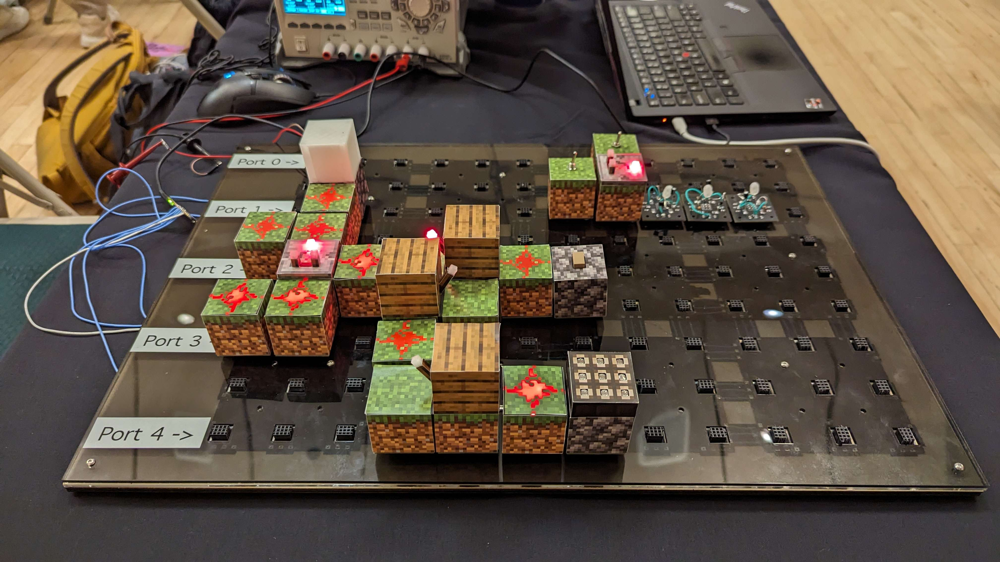

# Craft18

Goal: Re-create Minecraft Redstone components in the physical world using _only_ analog circuits, no microcontrollers or CPUs. Then, bridge the "physical-world" Redstone into the game using a custom plugin and Arduino USB-GPIO bridge, while maintaining the ability for "physical-world" Redstone to operate fully independently from the game as well.

Also see our [circuit diagrams PDF](doc/schem.pdf) to see how each circuit is implemented!

## Repo Structure

- [3D printable CAD models for each block](3d_cad/)
- [Texture images for each block](textures/)
- [Raw circuit schematic files](schematics/)
- [Spigot plugin for physical-to-virtual bridge](craft18_plugin/)
- [Software for physical-to-virtual bridge](craft18duino/)
- [Baseplate CAD files](2d_cad/)
- [Connector board layouts](boards/)
